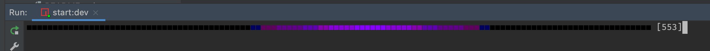

# L1ght-Str1p

---

[](https://app.codeship.com/projects/423215)

The light strip in my lounge.

## Features
- Runs on a Raspberry Pi Zero
- CI/CD integration
- Plugin interface
- IOT (Homekit) compatibility

### Debug Mode

Add the following environment variable(s) to enable debug mode. It is already included in the `start:dev` npm script

```dotenv
DEBUG=1

# Optional
FORCE_COLOR=3 # Enable colour regardless of the terminal (see https://github.com/chalk/chalk#chalksupportscolor)
```

